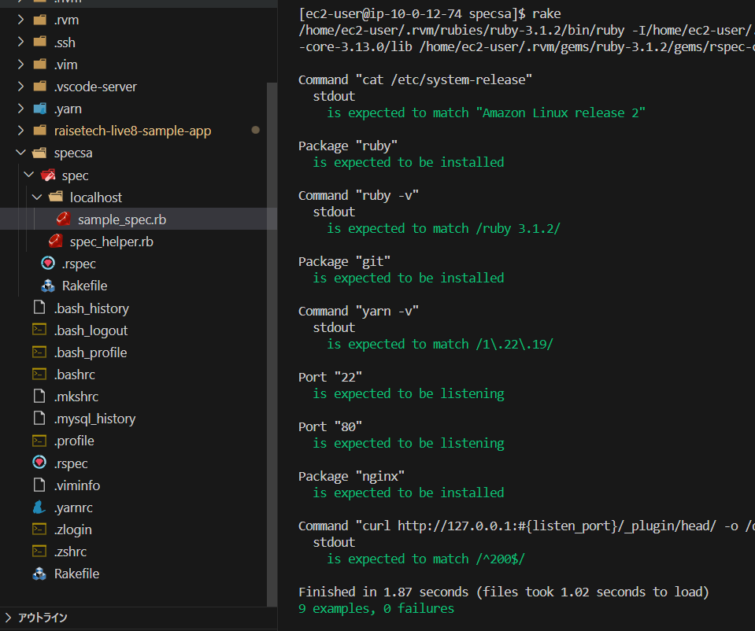

# 第１１回課題

## 次回までの課題

* 提供してもらったサンプルを授業を参考にカスタマイズ
* 自由な発想で色々試して、ServerSpec のテストが成功させること
  
## test

* ディレクトリを新しく作成(home/ec2-user/specsa)


インストールを行う

```
gem install serverspec
```

設定ファイルの生成
```
serverspec-init
```

OSはどれか？ローカルか？SSHか？
 １）UNIXを選択
 ２）localを選択

specsa/spec/localhost/sample_spec.rbのファイルに書き込みを行う


```
require 'spec_helper'
 
 listen_port = 80

#OSの確認
 describe command("cat /etc/system-release") do
    its(:stdout) { should match "Amazon Linux release 2" }
  end
#rubyインストール確認
  describe package('ruby') do
    it { should be_installed } 
  end
#rubyバージョン確認
  describe command('ruby -v') do
    its(:stdout) { should match /ruby 3.1.2/ }
  end
#gitインストール確認
  describe package('git') do
    it { should be_installed }
  end
#yarnバージョン確認
  describe command('yarn -v') do
    its(:stdout) { should match /1\.22\.19/ }
  end
#SSH接続の22portがlistenしているか確認
  describe port("22") do
    it { should be_listening } 
  end
#80portがlistenしているか確認
  describe port(listen_port) do
    it { should be_listening }
  end
#nginxがインストールされていることを確認
  describe package('nginx') do
    it { should be_installed }
  end
#curlで200がくるかを確認 

  describe command('curl http://127.0.0.1:#{listen_port}/_plugin/head/ -o /dev/null -w "%{http_code}\n" -s') do
  its(:stdout) { should match /^200$/ }
end

```

## test実行

commend

```
rake spec
```

またはrake

### test結果




