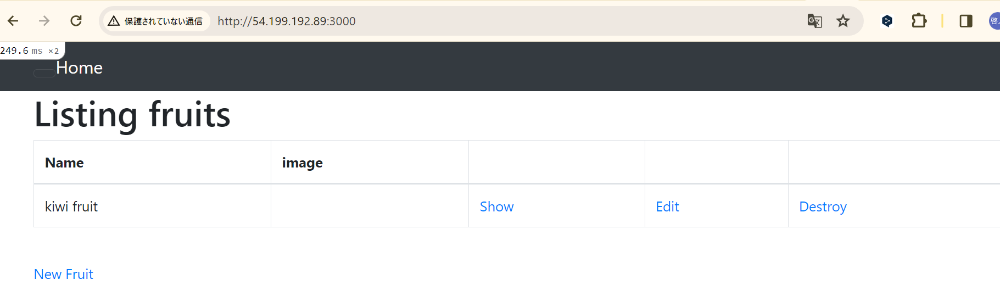
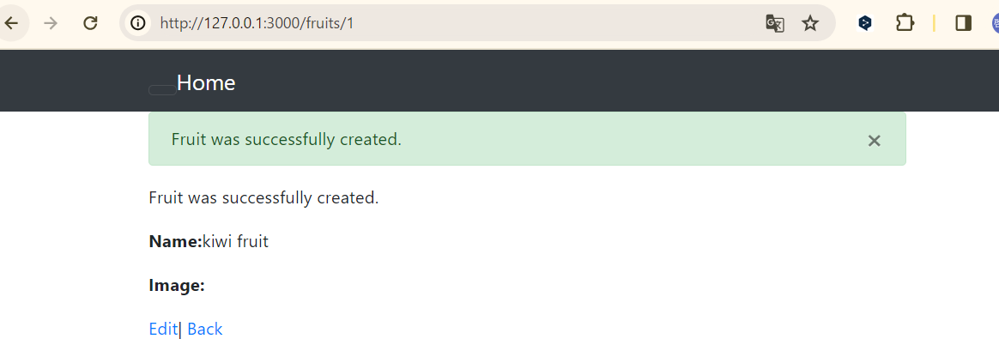

# 第５回課題


## 課題提出
* ec2上にサンプルアプリケーションのデプロイ　組み込みサーバー
* Web サーバー(Nginx)
* AP サーバー(Unicorn)
* ELB(ALB) 
*  S3 

* * *

## 環境構築
* raisetech-live8-sample-appのREADME

  - `ruby 3.1.2`
  - `Bundler 2.3.14`
  - `Rails 7.0.4`
  - `Node v17.9.1`
  - `yarn 1.22.19`

* * *

### ec2の環境構築

- パッケージの更新
```
sudo yum update -y
```

- gitインストール
```
sudo yum install git
```

- サンプルアプリケーションのクローンを作成
```
git clone https://github.com/yuta-ushijima/raisetech-live8-sample-app.git
```

- railsに必要なパッケージのインストール
```
sudo yum  -y install git make gcc-c++ patch libyaml-devel libffi-devel libicu-devel zlib-devel readline-devel libxml2-devel libxslt-devel ImageMagick ImageMagick-devel openssl-devel libcurl libcurl-devel curl
```

- RVM(rubyのバージョン管理)インストール

```
curl -L get.rvm.io | bash -s stable
gpg2 --keyserver hkp://keyserver.ubuntu.com --recv-keys 409B6B1796C275462A1703113804BB82D39DC0E3 7D2BAF1CF37B13E2069D6956105BD0E739499BDB
curl -sSL https://rvm.io/mpapis.asc | gpg2 --import -
curl -sSL https://rvm.io/pkuczynski.asc | gpg2 --import -
\curl -sSL https://get.rvm.io | bash -s stable

```

- Ruby

```
rvm install "ruby-3.1.2"
source /home/ec2-user/.rvm/scripts/rvm
rvm use --default 3.1.2
rvm rubygems latest
source ~/.bash_profile
```
- rubyバージョン確認

```
ruby -v
```
nvm(node.jsのバージョン管理)

```
curl -o- https://raw.githubusercontent.com/nvm-sh/nvm/v0.39.7/install.sh | bash
```
- nvmの設定、インストール、確認

```
. ~/.nvm/nvm.sh
nvm install 17.9.1
nvm -v
```

- npmを使用yarnインストール、確認

```
npm install -g yarn@1.22.19
yarn -v
```

-　Bundlerのインストール,確認

```
gem install bundler -v 2.3.14
bundler -v
```

- MariaDB用パッケージを削除

```
sudo yum remove -y mariadb-*
```

-  MySQLのリポジトリをyumに追加

```
sudo yum localinstall -y https://dev.mysql.com/get/mysql80-community-release-el7-11.noarch.rpm
```

- MySQLに必要なパッケージを取得

```
sudo yum install --enablerepo=mysql80-community mysql-community-server
```
```
sudo yum install --enablerepo=mysql80-community mysql-community-devel

```

- MySQL関連のパッケージを出力

```
yum list installed | grep mysql
```
- logファイルを作成
```
sudo touch /var/log/mysqld.log
```
- mysqldを起動,mysqldの状態を確認
```
sudo systemctl start mysqld
```
```
systemctl status mysqld.service
```
- mysqldがインスタンスの起動と同時に起動するように設定
```
sudo systemctl enable mysqld
```
- mysqldの停止
```
sudo service mysqld stop
```
- railsのインストール
```
gem install rails -v 7.0.4
bundle install
rails -v
```
- database.ymlの作成
```
cp config/database.yml.sample config/database.yml
```

- database.ymlの編集
```
default: &default
  adapter: mysql2
  encoding: utf8mb4
  pool: <%= ENV.fetch("RAILS_MAX_THREADS") { 5 } %>
  username: RDSのユーザー名
  password: RDSのパスワード
  host: RDSのエンドポイント
```
- MySQLログインできるか確認を行う,exitで終了
```
mysql -u ユーザー名 -p -h RDSのエンドポイント
```
- setup
```
bin/setup
```

- EC2のセキュリティーグループに3000番ポートを追加
- アプリケーションの起動
```
bin/dev
```
* 組み込みサーバーでのrailsアプリケーション動作確認



* * *

## Unicornを使ってのRailsアプリケーションの動作確認
* unucornのインストール
```
bundle install
※前にしてるので、必要なし
```
* lib/tasks ディレクトリに unicorn.rakeファイル作成
```
rails g task unicorn
```
* unicorn.rakeファイルの中のfile.readを編集
```
def unicorn_pid
    begin
      File.read("******************").to_i
    rescue Errno::ENOENT
      raise "Unicorn does not seem to be running"
    end
```
* Unicorn起動,確認
```
rake unicorn:start
```
```
ps -ef | grep unicorn | grep -v grep
```
* unicorn停止
```
rake unicorn:stop
```
## Nginxの単体起動確認

* nginxのインストール
```
sudo amazon-linux-extras install nginx1
```
* nginxの起動
```
sudo systemctl start nginx
```
* nginxのステータス確認
```
sudo systemctl status nginx
```
* nginx動作確認


なぜかユニコーンだけが動かない　　　　